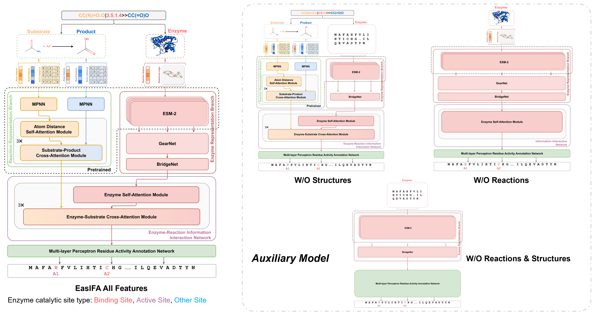

# EasIFA Core - Enzyme Active Site Inference Framework

EasIFA Core is the inference module for predicting enzyme active sites using protein structures and/or sequences, optionally with reaction information.



## Features

- Multiple model support:
  - **all_features**: Full model with enzyme structure + reaction information
  - **wo_structures**: Sequence-only model with reaction information  
  - **wo_reactions**: Structure-only model without reaction information
  - **wo_rxn_structures**: Sequence-only model without reaction information

- Flexible input:
  - Protein structure (PDB file) and/or amino acid sequence
  - Optional reaction SMILES string
  
- Easy-to-use command-line interface

## Quick Installation

### One-Command Setup (Recommended)

```bash
git clone https://github.com/wangxr0526/EasIFA2.0_Core.git
cd EasIFA2.0_Core
# bash quick_setup_ch.sh  # Accelerated download for Mainland China
bash quick_setup_intl.sh  # Download from Hugging Face
```

This will automatically download model checkpoints and set up the conda environment.


## Requirements

- Python >= 3.8
- PyTorch >= 1.10
- safetensors >= 0.3.0
- RDKit
- DGL (Deep Graph Library)
- ESM (Evolutionary Scale Modeling)
- TorchDrug
- Other dependencies (see requirements.txt)

**System Requirements:**
- 16 GB RAM (minimum 8 GB)
- 20 GB disk space for models
- GPU optional (NVIDIA CUDA for faster inference)

## Usage

### Command Line Interface

EasIFA supports both single and batch predictions via the command line.

#### Single Prediction Examples

**1. Predict with structure and reaction:**

```bash
easifa-predict \
    --enzyme-structure test/test_inferece_input/AF-A0A2K5QMP9-F1-model_v4.pdb \
    --rxn-smiles "O.OCC1OC(OC2C(O)C(CO)OC(OC3C(O)C(O)OC(CO)C3O)C2O)C(O)C(O)C1O>>O=C[C@H](O)[C@@H](O)[C@H](O)[C@H](O)CO" \
    --output result.json
```

**2. Predict with sequence and reaction:**

```bash
easifa-predict \
    --enzyme-sequence "MSPRPLRALLGAAAAALVSAAALAFPSQAAANDSPFYVNPNMSSAEWVRNNPNDPRTPVIRDRIASVPQGTWFAHHNPGQITGQVDALMSAAQAAGKIPILVVYNAPGRDCGNHSSGGAPSHSAYRSWIDEFAAGLKNRPAYIIVEPDLISLMSSCMQHVQQEVLETMAYAGKALKAGSSQARIYFDAGHSAWHSPAQMASWLQQADISNSAHGIATNTSNYRWTADEVAYAKAVLSAIGNPSLRAVIDTSRNGNGPAGNEWCDPSGRAIGTPSTTNTGDPMIDAFLWIKLPGEADGCIAGAGQFVPQAAYEMAIAAGGTNPNPNPNPTPTPTPTPTPPPGSSGACTATYTIANEWNDGFQATVTVTANQNITGWTVTWTFTDGQTITNAWNADVSTSGSSVTARNVGHNGTLSQGASTEFGFVGSKGNSNSVPTLTCAAS" \
    --rxn-smiles "CC(=O)O>>CCO" \
    --output result.json
```

**3. Predict with sequence only (no reaction):**

```bash
easifa-predict \
    --enzyme-sequence "MSPRLKQVNLCDEFGHIKLMNPQRSTVWY" \
    --output result.json
```

**4. Predict with structure only (no reaction):**

```bash
easifa-predict \
    --enzyme-structure test/test_inferece_input/AF-A0A2K5QMP9-F1-model_v4.pdb \
    --output result.json
```

#### Batch Prediction

For processing multiple proteins, create a JSON file with your batch tasks:

**batch_input.json:**
```json
[
  {
    "id": "protein_1",
    "enzyme_structure": "test/test_inferece_input/AF-A0A2K5QMP9-F1-model_v4.pdb",
    "rxn_smiles": "O.OCC1OC(OC2C(O)C(CO)OC(OC3C(O)C(O)OC(CO)C3O)C2O)C(O)C(O)C1O>>O=C[C@H](O)[C@@H](O)[C@H](O)[C@H](O)CO"
  },
  {
    "id": "protein_2",
    "enzyme_sequence": "MSPRPLRALLGAAAAALVSAAALAFPSQAAANDSPFYVNPNMSSAEWVRNNPNDPRTPVIRDRIASVPQGTWFAHHNPGQITGQVDALMSAAQAAGKIPILVVYNAPGRDCGNHSSGGAPSHSAYRSWIDEFAAGLKNRPAYIIVEPDLISLMSSCMQHVQQEVLETMAYAGKALKAGSSQARIYFDAGHSAWHSPAQMASWLQQADISNSAHGIATNTSNYRWTADEVAYAKAVLSAIGNPSLRAVIDTSRNGNGPAGNEWCDPSGRAIGTPSTTNTGDPMIDAFLWIKLPGEADGCIAGAGQFVPQAAYEMAIAAGGTNPNPNPNPTPTPTPTPTPPPGSSGACTATYTIANEWNDGFQATVTVTANQNITGWTVTWTFTDGQTITNAWNADVSTSGSSVTARNVGHNGTLSQGASTEFGFVGSKGNSNSVPTLTCAAS",
    "rxn_smiles": "CC(=O)O>>CCO"
  },
  {
    "id": "protein_3_no_reaction",
    "enzyme_sequence": "MSPRLKQVNLCDEFGHIKLMNPQRSTVWY"
  },
  {
    "id": "protein_4_structure_only",
    "enzyme_structure": "test/test_inferece_input/AF-A0A2K5QMP9-F1-model_v4.pdb"
  }
]
```

**Run batch prediction:**
```bash
easifa-predict \
    --batch-input batch_input.json \
    --output batch_results.json \
    --verbose
```

**Note:** All file paths in the batch input JSON are resolved relative to your current working directory.

See `BATCH_PREDICTION_GUIDE.md` for more detailed batch prediction instructions.

### Python API

```python
from easifa_core import EasIFAInferenceAPI, EasIFAInferenceConfig

# Initialize configuration
config = EasIFAInferenceConfig()

# Create inference API
easifa = EasIFAInferenceAPI(config)

# Example 1: Predict with structure and reaction
pred, prob = easifa.inference(
    rxn_smiles="O.OCC1OC(OC2C(O)C(CO)OC(OC3C(O)C(O)OC(CO)C3O)C2O)C(O)C(O)C1O>>O=C[C@H](O)[C@@H](O)[C@H](O)[C@H](O)CO",
    enzyme_structure_path="test/test_inferece_input/AF-A0A2K5QMP9-F1-model_v4.pdb"
)

# Example 2: Predict with sequence and reaction
pred, prob = easifa.inference(
    rxn_smiles="CC(=O)O>>CCO",
    enzyme_aa_sequence="MSPRPLRALLGAAAAALVSAAALAFPSQAAANDSPFYVNPNMSSAEWVRNNPNDPRTPVIRDRIASVPQGTWFAHHNPGQITGQVDALMSAAQAAGKIPILVVYNAPGRDCGNHSSGGAPSHSAYRSWIDEFAAGLKNRPAYIIVEPDLISLMSSCMQHVQQEVLETMAYAGKALKAGSSQARIYFDAGHSAWHSPAQMASWLQQADISNSAHGIATNTSNYRWTADEVAYAKAVLSAIGNPSLRAVIDTSRNGNGPAGNEWCDPSGRAIGTPSTTNTGDPMIDAFLWIKLPGEADGCIAGAGQFVPQAAYEMAIAAGGTNPNPNPNPTPTPTPTPTPPPGSSGACTATYTIANEWNDGFQATVTVTANQNITGWTVTWTFTDGQTITNAWNADVSTSGSSVTARNVGHNGTLSQGASTEFGFVGSKGNSNSVPTLTCAAS"
)

# Example 3: Predict with sequence only (no reaction)
pred, prob = easifa.inference(
    enzyme_aa_sequence="MSPRLKQVNLCDEFGHIKLMNPQRSTVWY"
)

# Example 4: Predict with structure only (no reaction)
pred, prob = easifa.inference(
    enzyme_structure_path="test/test_inferece_input/AF-A0A2K5QMP9-F1-model_v4.pdb"
)

# Results format
print(f"Predicted labels: {pred}")  # Per-residue site type predictions (0-3)
print(f"Probabilities: {prob}")      # Probability distributions per residue

# Site type mapping:
# 0: non-site
# 1: BINDING
# 2: ACT_SITE
# 3: SITE
```

## Model Configuration

The default configuration uses CPU for inference. To use GPU, modify the `gpu_allocations` in `EasIFAInferenceConfig`:

```python
config = EasIFAInferenceConfig()
config.gpu_allocations = {
    "all_features": 0,         # GPU 0
    "wo_structures": 0,        # GPU 0
    "wo_reactions": 0,         # GPU 0
    "wo_rxn_structures": 0,    # GPU 0
}
```

## Output Format

The inference returns:
- `pred`: Predicted active site type labels for each residue (0: non-site, 1: BINDING, 2: ACT_SITE, 3: SITE)
- `prob`: Probability distribution over site types for each residue

## License

MIT License

## Citation

If you use EasIFA in your research, please cite:

```
```

